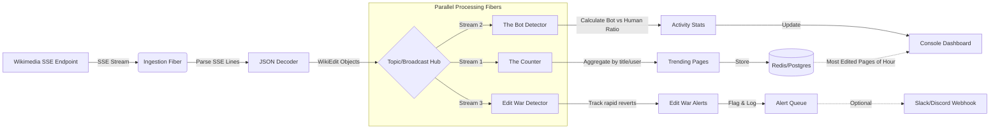

# The "Wikipedia Edit War" Monitor

### The Data Source: Wikimedia EventStreams

- Why: It is a public, unauthenticated, infinite stream of every edit happening on all Wikimedia projects (Wikipedia, Wiktionary, etc.) in real-time.
- Protocol: Server-Sent Events (SSE) (distinct from WebSockets, good for learning HTTP streaming).
- Endpoint: https://stream.wikimedia.org/v2/stream/recentchange
- Volume: Very high. Hundreds of edits per second globally.

### The Project Concept: A system that detects "Edit Wars" (rapid back-and-forth reverts) or monitors vandalism in real-time.

### Architecture key components:

**Ingestion Layer:**

- **Ingestion Fiber:** Connect via HTTP and parse the SSE stream (lines starting with data:).
- **JSON Decoder:** Transform raw SSE lines into structured `WikiEdit` objects using Circe.
- **Topic/Broadcast Hub:** Single-producer, multi-subscriber pattern using `fs2.concurrent.Topic`. Broadcasts each `WikiEdit` to all parallel processing fibers without opening multiple connections to Wikipedia.

**Processing Layer (Parallel Fibers):**

- **Fiber 1 - The Counter:** Aggregate edits by user_name or title. If a single page gets > 5 edits in 10 seconds, flag it as "Trending/Hot". Outputs trending pages.
- **Fiber 2 - The Bot Detector:** Filter for the bot: true flag. Calculate the ratio of Human vs. Bot activity in real-time. Updates activity statistics.
- **Fiber 3 - Edit War Detector:** Maintain a sliding window of recent edits per page. Detect rapid back-and-forth reverts by tracking edit patterns and revert comments. When velocity exceeds threshold (e.g., 3+ reverts in 2 minutes with multiple participants), emit an `EditWarAlert`.

**Sink Layer:**

- **Redis/Postgres:** Persistent storage for "Most Edited Pages of the Hour" from The Counter.
- **Console Dashboard:** Real-time display of Bot vs Human activity statistics and trending pages.
- **Alert Queue:** Bounded `fs2.concurrent.Queue` that buffers edit war alerts with backpressure, decoupling detection from downstream alerting.
- **Slack/Discord Webhook (Optional):** Human notification channel for high-priority edit war alerts, drained from the Alert Queue with rate limiting.

Because SSE is just a long-lived HTTP request, handling the network interruptions is critical. You will learn how to use fs2.Stream.lines to chunk the incoming bytes into lines, and then decode the JSON.

## Architecture



## 🛠 Tech Stack

- **Runtime:** [Cats Effect 3](https://typelevel.org/cats-effect/) (For managing Fibers and Concurrency).
- **Streaming:** [FS2 (Functional Streams for Scala)](https://fs2.io/) (The "glue" for your architecture).
- **HTTP Client:** [Http4s](https://http4s.org/) (Built on FS2, natively supports SSE).
- **JSON:** [Circe](https://circe.github.io/circe/) (For decoding the chaotic Wikipedia JSON schema).

---

## 🏗 Deep Dive: Key Technical Challenges

### 1. Handling the "Firehose" with Backpressure

The Wikimedia stream is fast. If your "Sink" (database) is slower than the "Source" (SSE), your app will crash with an `OutOfMemoryError`.

- **The Learning Point:** Using FS2's `.through` and `.parEvalMap` to process events in parallel while maintaining backpressure.

### 2. The "Topic/Hub" Pattern

You don't want to open three connections to Wikipedia for three different features. You open **one** connection and broadcast the data.

- **The Learning Point:** Use `fs2.concurrent.Topic`. It allows one producer to distribute data to multiple "Subscriber" fibers (Vandalism Detector, Stats Aggregator, etc.) asynchronously.

### 3. State Management (The "Edit War" Logic)

Detecting an edit war requires "memory." You need to track how many times `Page X` was edited in the last minutes.

- **The Learning Point:** Use `cats.effect.Ref` (for shared thread-safe state) or `fs2.Stream.scan` to maintain a rolling window of activity without needing an external database for every single calculation.

---

## 🧪 Advanced Features to Add

To turn this from a "weekend project" into a "Senior-level portfolio piece" I might add:

### A. The "Sentiment" Filter

Integrate a simple NLP library or a lightweight Scala wrapper for an LLM API.

- **Task:** If a "revert" happens, analyze the comment. If the comment contains aggressive language or certain keywords (e.g., "rvv" - revert vandalism), flag it with higher priority.

### B. Resilience Testing

SSE connections drop constantly.

- **Task:** Implement an exponential backoff retry strategy using `fs2.Stream.retry`. Show that your app can survive a network flicker without losing its place in the stream (using the `Last-Event-ID` header).

### C. Semantic Compression

The raw JSON is massive.

- **Task:** Create a "Domain Model" (Scala Case Classes) that only extracts the 5% of data you actually need. Use Circe's `forProductX` decoders to keep the footprint tiny.

---

## 📊 Sample Data Model

The core logic will revolve around a structure like this:

```scala
case class WikiEdit(
  title: String,
  user: String,
  bot: Boolean,
  comment: String,
  timestamp: Long,
  serverName: String
)

// The "War" Signal
case class EditWarAlert(
  title: String,
  velocity: Int, // edits per minute
  participants: Set[String]
)

```

---

## 🚀 How to Start

1. **Phase 1:** Use `Http4s` client to simply print the stream of strings from the Wikimedia URL to your console.
2. **Phase 2:** Implement a Circe decoder to turn those strings into `WikiEdit` objects.
3. **Phase 3:** Introduce the `Topic` to split the stream into a "Bot Stats" fiber and a "Human Activity" fiber.
